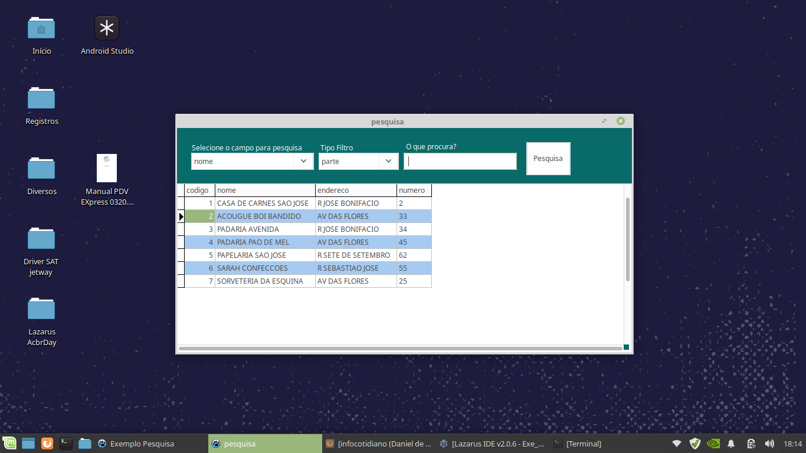

# Lazarus - Formulário de Pesquisa padrão
### PROGRAMA: Formulário de pesquisa padrão
## passando parâmetros entre formulários.

# IDE LAZARUS 

### Autor: Daniel de Morais (https://www.youtube.com/user/infocotidiano/)

Exemplo de como criar um formulário de pesquisa padrão, podendo usar em todos sistemas. 
Banco de Dados criado em MySQL - Backup da base dentro da pasta basededados.
Componente para conexão com o banco de dados. ZEOSLib

Quando chamar o formulário de pesquisa, passar como parâmetros: 
* Array de Campos que serão exibidos 
* Nome da Tabela para pesquisa dinâmica 
* Campo de retorno 

Exemplo:
> frmPesquisa := tfrmPesquisa.Create(self,['codigo','nome','telefone'],'cliente','nome');

### Link para o meu video: (https://youtu.be/LIS3fJSkTL4)
